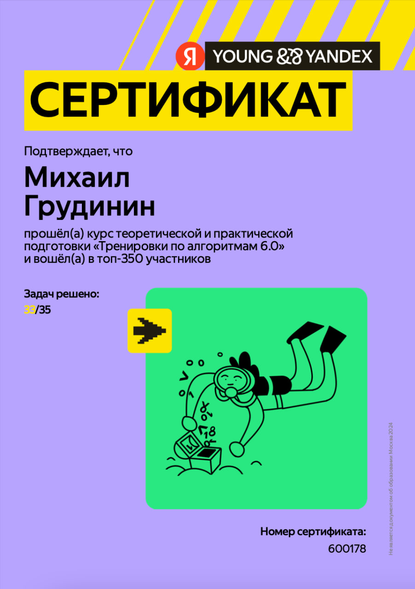

# Тренировки по алгоритмам 6.0 от Яндекса

179 место в рейтинге: https://yandex.ru/yaintern/training/results-algorithm-6

<h3>Лекции тренировок:</h3>

---

  - [Лекция 1. Тестирование](https://www.youtube.com/live/c67zB3FWLOs)
  - [Разбор задач первой лекции](https://www.youtube.com/live/Gk5KrTA5hpQ)

---

  - [Лекция 2. Префиксные суммы и два указателя](https://www.youtube.com/live/B4uP6igiVNU)
  - [Разбор задач второй лекции](https://www.youtube.com/live/T3-4f5SZy3Y)

---

  - [Лекция 3. Стеки, очереди, деки](https://www.youtube.com/live/km0E_i8Dtso)
  - [Разбор задач третьей лекции](https://www.youtube.com/live/Fg5uDgPZDoo)

---

  - [Лекция 4. Деревья, представления, обходы](https://www.youtube.com/live/O9ffppQ05-c)
  - [Разбор задач четвертой лекции](https://www.youtube.com/live/P6SqATvWYpY)

---

  - [МОК-интервью и его разбор](https://www.youtube.com/live/rNieihJ5U18)
